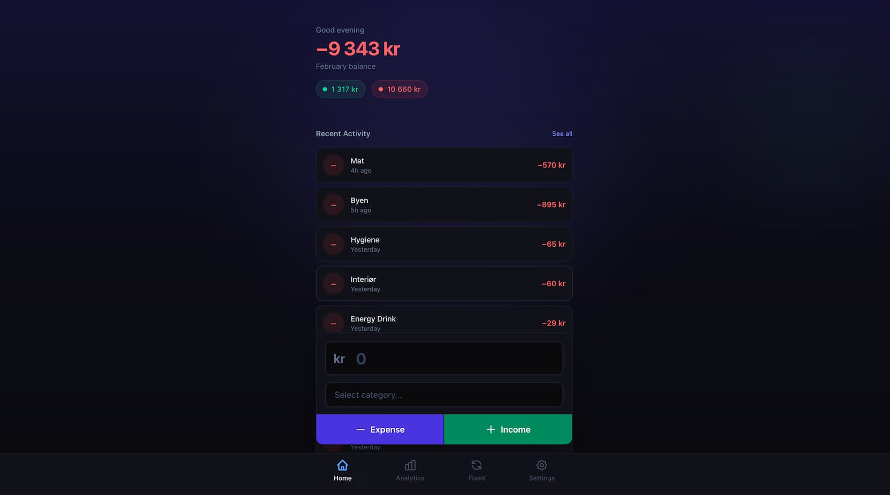

# Expense Tracker

A simple expense tracking application designed for mobile use. View it live at [ex.edvardsen.dev](https://ex.edvardsen.dev).

Install it as a Progressive Web App (PWA) on your phone for the best experience:

1. Log in to your account
2. Navigate to the Settings page
3. Tap "Add to Home Screen"



## Development

1. Copy the example environment file:

   ```bash
   cp .env.example .env
   ```

2. Install dependencies:

   ```bash
   pnpm install
   ```

3. Run the development server:
   ```bash
   pnpm dev
   ```
