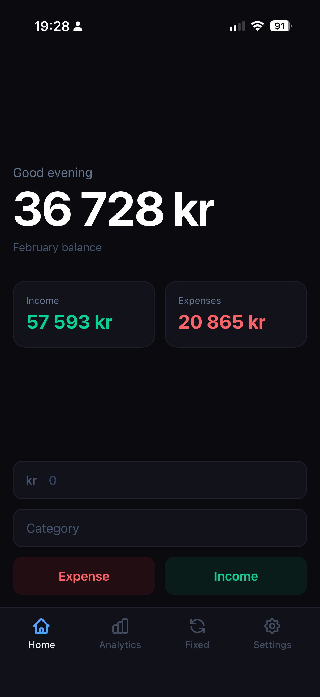
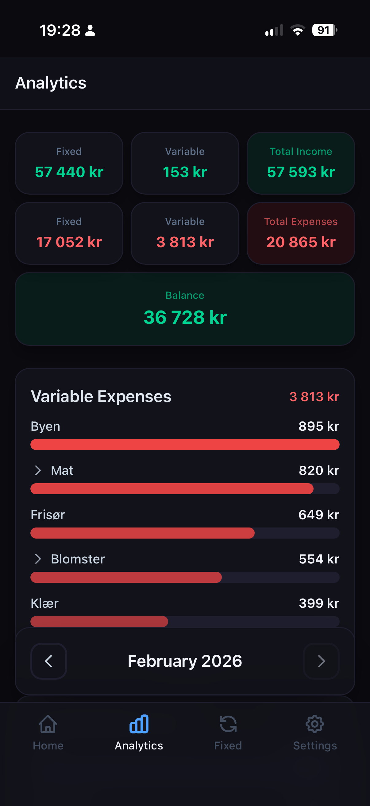
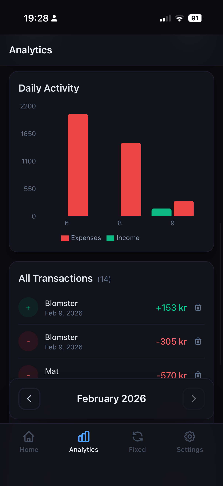
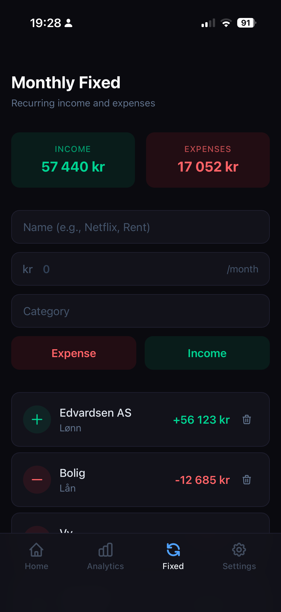
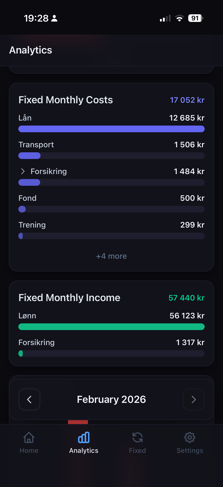

# Expense Tracker

A simple expense tracking application designed for mobile use. Built for quick, on-the-go tracking with an intuitive interface that makes logging transactions effortless. View it live at [ex.edvardsen.dev](https://ex.edvardsen.dev).

## Features

- **Variable & fixed income/expenses** – Track one-time and recurring transactions
- **Analytics with drill-down** – Explore spending patterns by category and dive into daily breakdowns
- **Historical data** – Browse and analyze past months

## Mobile App

Install it as a Progressive Web App (PWA) on your phone for the best experience:

1. Log in to your account
2. Navigate to the Settings page
3. Tap "Add to Home Screen"

<table>
  <tr>
    <td></td>
    <td></td>
    <td></td>
    <td></td>
    <td></td>
  </tr>
</table>

## Development

1. Copy the example environment file:

   ```bash
   cp .env.example .env
   ```

2. Install dependencies:

   ```bash
   pnpm install
   ```

3. Run the development server:
   ```bash
   pnpm dev
   ```
